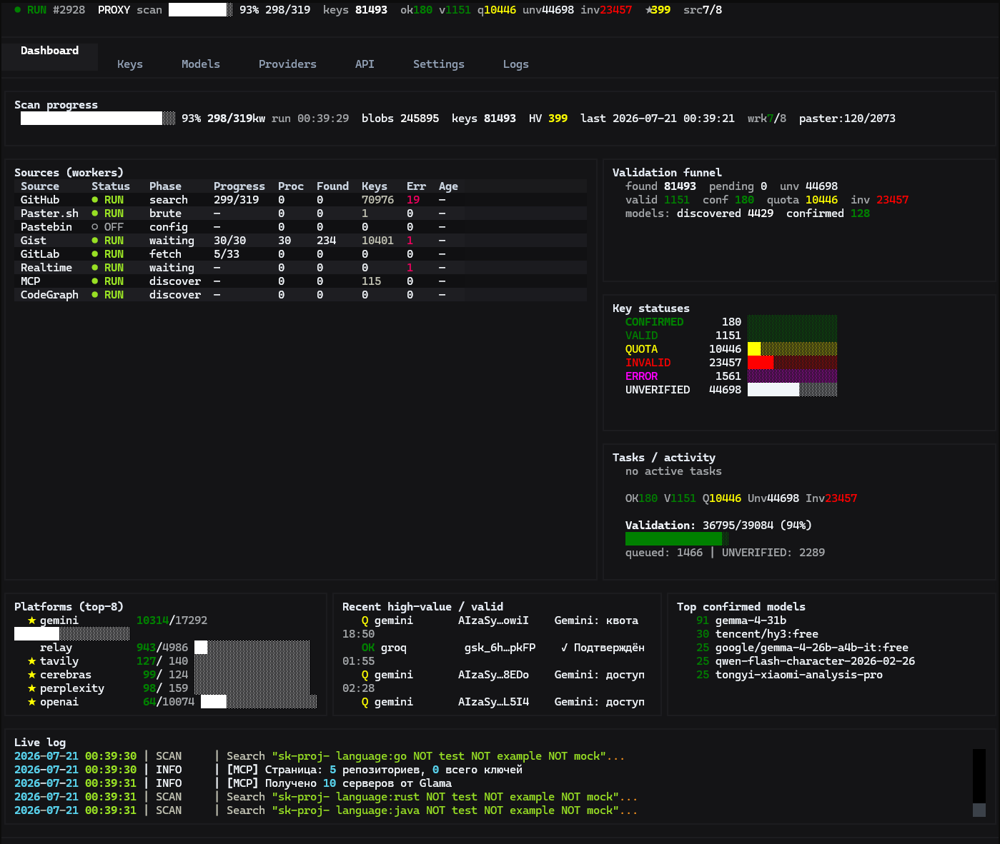
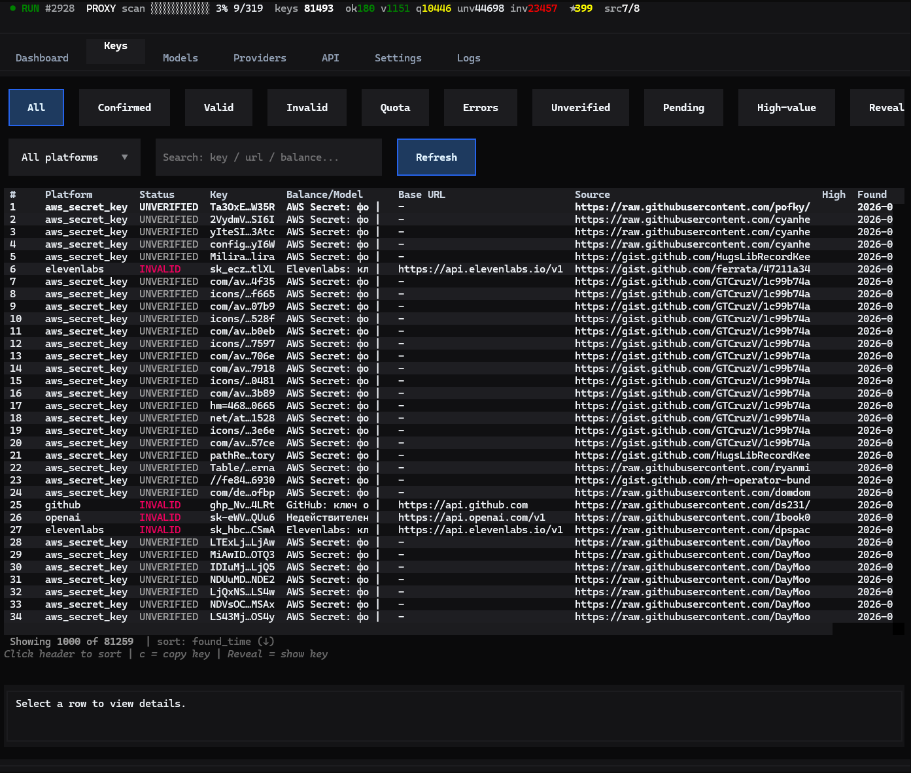
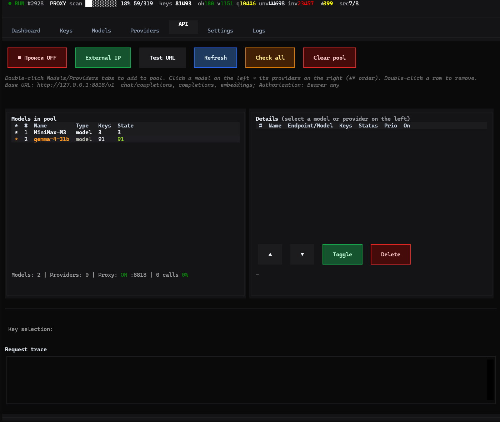

# Secret Scanner Pro

<p align="center">
  <b>Поиск API-ключей · валидация · локальный OpenAI-совместимый прокси</b>
</p>

<p align="center">
  <a href="./README.md"></a>
  <a href="./README.ru.md"></a>
</p>

<p align="center">
  
  
  
  
</p>

<p align="center">
  
</p>

> Полная документация на английском (и RU-секция в том же файле): **[README.md](./README.md)**  
> Ниже — чистая русская страница (удобно для закладок).

---

## О проекте

Операторский TUI: **8 источников**, валидация **30+ платформ**, пул confirmed-моделей, раздача через **OpenAI-совместимый** прокси `:8818`.

> Только исследования / обучение / системы с разрешением.

## Возможности

| Блок | Содержание |
|------|------------|
| Источники | GitHub · Gist · GitLab · Paster · Pastebin · Realtime · MCP · CodeGraph |
| TUI | Тёмный дашборд, воркеры, ключи, модели, API-пул |
| Прокси | `/v1/chat/completions` + stream, sticky / round-robin |
| Windows | `start_tui.bat` · `start_scanner.bat` |

## Скриншоты

На всю ширину (не в таблице — иначе GitHub делает картинки мизерными):

**Дашборд**

<p align="center">
  
</p>

**Ключи**

<p align="center">
  
</p>

**API**

<p align="center">
  
</p>

## Быстрый старт

```bash
git clone <url> Github-API-scan
cd Github-API-scan
pip install -e .   # одна команда: зависимости + лаунчер `ascan`
copy config_local.py.example config_local.py
```

Файл токенов (полный путь):

```text
C:\Users\<вы>\Github-API-scan\config_local.py
```

```python
GITHUB_TOKENS = ["ghp_ВАШ_ТОКЕН"]
```

```bash
ascan            # TUI из любого места
# или: ./start_tui.sh | start_tui.bat | python main_optimized.py
# обновление без потери ключей/БД: ascan upgrade
```

## Прокси

```text
http://127.0.0.1:8818/v1
```

## Тесты

```bash
python -m pytest tests/ -q
```

## Лицензия

[MIT](LICENSE)
